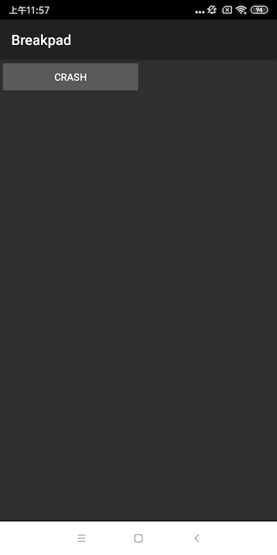

Chapter01-GEEKTIME
======
例子里集成了[Breakpad](https://github.com/google/breakpad) 来获取发生 native crash 时候的系统信息和线程堆栈信息。

注意：由于例子里提供的 minidump_stackwalker(生成的位置已在breakpad/breakpad/src/processor目录下) 可能由于环境不同，无法启动，建议同学自行编译来获取工具，具体教程可见https://github.com/google/breakpad

minidump_stackwalker工具生成的资源文件分别下载到breakpad目录和depot_tools目录，可以直接进行命令进行生成，具体教程可见https://github.com/google/breakpad。

编译环境
=======
Android Studio 3.0
CMAKE
NDK(使用ndk版本19.1)

项目构建
=======

例子采用 [CMAKE](https://developer.android.com/ndk/guides/cmake) 来构建 breakpad  库, 项目可直接导入 AndroidStudio 运行

例子支持`armeabi-v7a`,`arm64-v8a`,`x86` 三种平台。

1. 点击`crash`按钮应用会发生一个native崩溃

2. 生成的 crash信息，如果授予Sdcard权限会优先存放在`/sdcard/crashDump`下，便于我们做进一步的分析。反之会放到目录 `/data/data/com.dodola.breakpad/files/crashDump`




Dump 日志分析
========

1. 将抓取到的日志拉取到本地中
2. 使用例子中提供的 `tools/mac/minidump_stackwalker` 工具来根据 minidump 文件生成堆栈跟踪log
```
	 ./tools/mac/minidump_stackwalk crashDump/***.dmp >crashLog.txt 
```
	 
3. 打开文件后可以看到一个详细的 crash 日志，如下

```
Operating system: Android
                  0.0.0 Linux 3.18.14-11528205 #1 SMP PREEMPT Wed Jul 12 18:17:45 KST 2017 armv8l
CPU: arm
     ARMv1 vendor(0x53) part(0x5300d030) features: half,thumb,fastmult,vfpv2,edsp,neon,vfpv3,tls,vfpv4,idiva,idivt
     8 CPUs

GPU: UNKNOWN

Crash reason:  SIGFPE / 0xfffffffa
Crash address: 0xdb7
Process uptime: not available

Thread 0 (crashed)
 0  libc.so + 0x4a1c0   //crash 发生时候的线程，因为这个so库是系统的，需要往上找到我们的so库
     r0 = 0x00000000    r1 = 0x00000db7    r2 = 0x00000008    r3 = 0x00000003
     r4 = 0xf037058c    r5 = 0x00000008    r6 = 0xf0370534    r7 = 0x0000010c
     r8 = 0xff8111e0    r9 = 0xece05400   r10 = 0xece0548c   r12 = 0x00000058
     fp = 0xff810f2c    sp = 0xff810e38    lr = 0xef895957    pc = 0xef8981c0
    Found by: given as instruction pointer in context
 1  dalvik-main space_3274_3274 (deleted) + 0x6b0fe
     sp = 0xff810e3c    pc = 0x12c6b100
    Found by: stack scanning
 2  libc.so + 0x1d957
     sp = 0xff810e50    pc = 0xef86b959
    Found by: stack scanning
 3  dalvik-LinearAlloc_3274_3274 (deleted) + 0xe6
     sp = 0xff810e54    pc = 0xe2ca40e8
    Found by: stack scanning
 4  libcrash-lib.so + 0x1fdd    //crash 我们的代码的位置  
     sp = 0xff810e58    pc = 0xeb75dfdf
    Found by: stack scanning
 5  libcrash-lib.so + 0x8ff //crash 我们的代码的位置 
     sp = 0xff810e60    pc = 0xeb75c901
    Found by: stack scanning
 6  system@framework@boot-core-libart.art + 0xa3c6d
     sp = 0xff810e80    pc = 0x6f772c6f
    Found by: stack scanning
 7  dalvik-main space_3274_3274 (deleted) + 0xea46c70
     sp = 0xff810e84    pc = 0x21646c72
```

4. 符号解析，可以使用 ndk 中提供的`addr2line`来根据地址进行一个符号反解的过程,该工具在 
`$NDK_HOME/toolchains/arm-linux-androideabi-4.9/prebuilt/darwin-x86_64/bin/arm-linux-androideabi-addr2line`
 
 注意：此处要注意一下平台，如果是 arm64位的 so，解析是需要使用 `aarch64-linux-android-4.9`下的工具链
```
arm-linux-androideabi-addr2line -f -C -e sample/build/intermediates/transforms/mergeJniLibs/debug/0/lib/armeabi-v7a/libcrash-lib.so 0x1fdd                           
//输出结果如下
__aeabi_ldiv0   //说明是除于0的操作引起的异常，继续往下面进行符号反解

arm-linux-androideabi-addr2line -f -C -e sample/build/intermediates/transforms/mergeJniLibs/debug/0/lib/armeabi-v7a/libcrash-lib.so 0x8ff                           
//输出结果如下
Crash()
sample/src/main/cpp/crash.cpp:16

```
补充内容
=======

关于在 x86模拟器下无法生成 crash 日志问题的解决方法

在 x86 模拟器下无法生成日志的解决方法如下：
1. 将 ndk 切换到 16b，下载地址： https://developer.android.com/ndk/downloads/older_releases?hl=zh-cn 
mac 版：https://dl.google.com/android/repository/android-ndk-r16b-darwin-x86_64.zip
2. 在 Androidstudio 里设置 ndk 路径为ndk-16b的路径
3. 在 sample 和 breakpad-build 的 build.gradle 配置里增加如下配置
```
 externalNativeBuild {
            cmake {
                cppFlags "-std=c++11"
                arguments "-DANDROID_TOOLCHAIN=gcc"
            }
        }

```


相关内容
=======
https://github.com/google/breakpad
例子里只提供了 Mac 的工具，如果需要其他平台的工具，可以去编译源码获得，可以参照 breakpad 项目的说明文档来编译获取。
